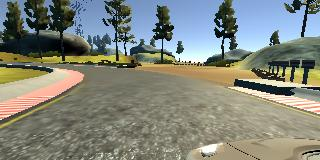
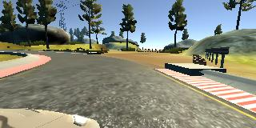
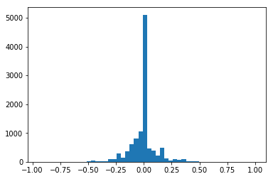
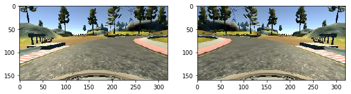
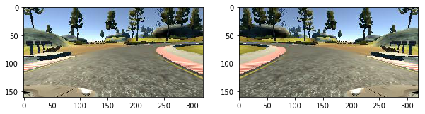
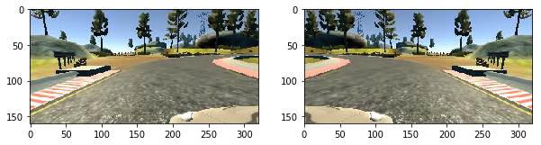
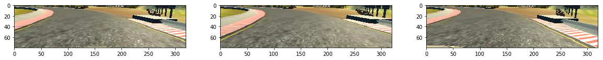
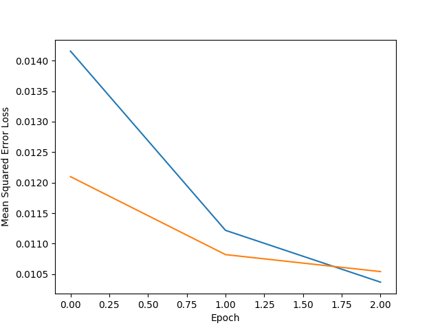

# Self-Driving Car Engineer Nanodegree

## Deep Learning

## Project: Behaviour Cloning with Convolutional Neural Networks
***

## 1. Introduction
***
The aim of this project is to train a self-driving car to drive autonomously using Convolutional Neural Networks (CNN). Training data is gathered by manually driving around a relatively simple test track with wide road width and no center lane lines. 

This project is split into several steps:

- Data Collection
- Data Processing
- Network Architecture
- Network Training and Validation
- Network Results

We also take two approaches to this project.

**Approach 1:** Accompanying files for the main project include:

* clone_nvid.py: Our processing and training pipline script
* model_nvid_one.h5: Our trained CNN
* drive.py: Connection to simulator
* run1.mp4: Video of simulated autonomous vehicle

**Approach 2:** We also wanted to drive arounf track 2 in the correct lane and correct/safe speed so we created seperate CNNs to train a vehicle to traverse track 2 safely in the right lane. We discuss this at the end. However, for the scope of this project, we discuss the project steps in terms of the first model above. Files for our second approach include:

* clone_angle.py: 
* clone_speed.py
* model_nvid_angle.h5: predict steering angle
* model_nvid_speed.h5: predict speed
* drive_new.py
* run2.mp4

## 2. Implementation
***
### Capturing Data
Training data is gathered from three simulated dashboard cameras with different angles of view. Our training dataset comprised of a mixture of Udacity's data and our manually collected data. The total training dataset entered was 8628 datapoints. This resulted in We use strided convolutions in 51768 datapoints after utilising all three cameras and augmenting the dataset. Data collected in training mode include three camera images matched with steering angle, throttle, brake and speed. Data is gathered by manually driving the simulated vehicle. At each point in time, the simulated dashboard cameras generate and store three simultaneous images demonstared below:

<tr>
<td>  </td>
<td>  </td>
<td>  </td>
</tr>

To include all three cameras, an angle correction was used. This is explained best in the image below. A correction of negative .15 and positive .15 was added to the steering angle corresponding to left and right images to enable us to utilises all three cameras. A fixed correction of .15 was applied as it yielded the best results. 

<tr><td>  </td>
    
The data captured was very biased towards a steering angle of 0 as we might expect given the stretches of straght roads. The hitogram below demonstrates that. Although not done in this project, we could have limited datapoints with 0 steering angle to prevent the network being overly biased towards 0 and to support generalization.

<td>  </td></tr>

### Data Processing
We employ two image preprocessing methods that support a more generalised CNN, seamlessly increase the dataset size and accelerate network training. These methods include:

* Normalization
* Image Flipping
* Lambda Cropping

Normalization was used to achieve a well-conditioned problem with zero mean and equal variance. Each pixel was divided by 255 and 0.5 was subtracted so that the range was between -.5 and +.5.

Track 1 is typically biased towards left steering due to the nature of the track. As a result of this natural left turn bias, we horizontally flipped each image and corresponding steering angle (i.e. multiply by -1). This not only mitigates the left turn bias but also seamlessly doubles out dataset. The images below demonstrate normal and flipped images from the center (top), left (middle) and right (bottom) cameras.

<td>  </td>
<td>  </td>
<td>  </td>

Examining the camera images further, we can see that a large proportion of the top half of the image includes sky, trees etc. This is largely irrelevant for our CNN which should focus on road marking, road texture, lane lines etc. As a result, we removed the top X pixels from each image. We also removed the bottom X as the vehicle bonnet is also an irrelevant feature. Example copeed images are shown below:

<tr>
<td>  </td>

### Network Architecture
In this project we employed NVIDIA's CNN architecture shown in the image below. It comprises of nine layers. This includes a normalization layer at the beginning, five convolutional layers and finally three fully connected layers. Relu activation function is used for each convolutional layer. The first three convolutions use a 2x2 stride and 5x5 kernels whereas the last two use 3x3 kernels, also shown in the image below.

<tr>
<td>  </td>

## 3. Training and Validation

Given the size of the dataset, we employed `fit_generator` from the Keras library. We use a Python generator to generate data for training insteading of storing the training data. This is was a necessity for our networks. We use the adam optimizer which is similar to stochastic gradient descent with a learning rate of .001.

To monitor and prevent overfitting, the dataset was split with 80% as training and 20% as validation. To prevent overfitting the model, we monitored the validation accuracy changes over each epoch. Evidently, the validation loss began to rise at epoch 4 so we settled with 3 epochs. This is shown in the figures below:

<tr><td>  </td>
    
Additionally, we could have included dropout layers in our network to support generalization. However, for the purpose of this project, this network sufficed.

## 4. Results - Track 1
***
The video files for track 1 is shown below. The vehicle swerved slightly at the beginning due to the slightly right situated starting position. The vehicle had to revert back to the center first. Other than that, it did not cross the lines and maintained center driving relatively well. The results work best for "fast" resolution. The command line for this is:

`python drive.py model_nvid_one.h5`

<tr>
<td> <video controls src="output_images/run1.mp4" alt="Drawing" style="width: 475px;" align="center"/> </td>
</tr>

## Results - Track 2

In addition to this, we trained a seperate CNNs to navigate track 2. The reason we trained a seperate network was because we wanted a vehicle to safely drive in its lane. In track 1, there are no center lane lines and it is not a realistic driving scenario. In addition to training a seperate CNN for steering angle predictions, we also trained another to predict speed. From this, we ran `drive_new.py` with two CNNs working simultaneously. The velocity predictions are used to infer throttle and braking predictions. The video for this is shown below. There was one instance where we were required to interven manually towards the end of the track. With more time we would introduce random brightness and alternative image transforming techniques to better generalise the model. We feel that this could fix this problem. The results work best for "fast" resolution. 

Speed is an importnat factor when it comes to track 2. There are a number of sharp turns and steep slopes that necessitate harder braking or acceleration. Our model worked well predicting braking needs at these points, improving vehicle safety.

We also ran these models for track 1 shown in the right video. The results were relatively good. There was too much swerving but this might be expected given that this model is trained to stay in its lane. In addition, the vehicle didnt reach the speed we might expect given that the average speed driven in track 2 was much slower due to difficult roads.

The command line for this is:

`python drive_new.py model_nvid_angle.h5 model_nvid_speed.h5`

<tr>
<td> <video controls src="output_images/run2.mp4" alt="Drawing" style="width: 475px;" align="center"/> </video>
</tr>

<tr>
<td> <video controls src="output_images/run3.mp4" alt="Drawing" style="width: 475px;" align="center"/> </td>
</tr>

## 5. Conclusion

Overall the project was a success. The vehicle followed track 1 near perfectly. That said, this track doesnt reflect true 
driving conditions and so our model largely failed in track 2 with this model. In particular, the missing center lane makes it difficult to generalise to a track with a center lane.

We took two approaches to this prject. 
* First train the model on track 1 and test on track 1 and 2. The model failed to navigate track 2. 
* Secondly, we trained a model on track 2 and tested on both track 1 and 2. This was more or less a success as the vehicle navigated track 1 safely. The vehicle worked very well on track 2 also besides one sharp turn the vehicle failed to make. However, if we addedd additional training data focused on that point, the vehicle would have traversed track 2 perfectly.
