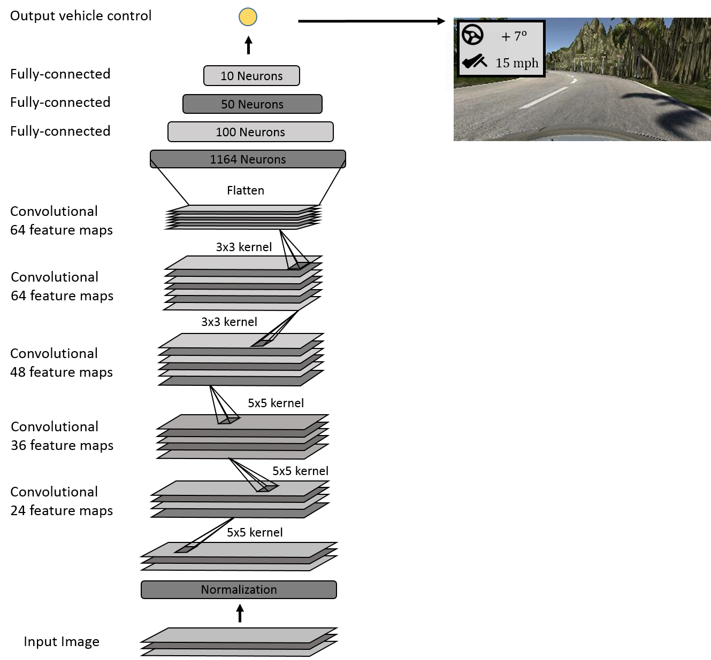

# Behaviour Cloning with Convolutional Neural Networks
***

## 1. Introduction
***
The aim of this project is to train a self-driving car to drive autonomously using Convolutional Neural Networks (CNN). Two CNNs are trained to predict steering angle and velocity simultaneously. Training data is gathered by manually driving around three test tracks. 

This project is split into several steps:

- Data Collection
- Data Processing
- Network Architecture
- Network Training and Validation
- Network Results

Accompanying files for the main project include:

* clone_angle.py: 
* clone_speed.py
* model_nvid_angle.h5: predict steering angle
* model_nvid_speed.h5: predict speed
* drive_new.py
* run2.mp4

## 2. Implementation
***
### Capturing Data
Training data is gathered from three simulated dashboard cameras with different angles of view. Our training dataset comprised of a mixture of Udacity's data and our manually collected data. The total training dataset entered was 8628 datapoints. Data collected in training mode include three camera images matched with steering angle, throttle, brake and speed. Data is gathered by manually driving the simulated vehicle. At each point in time, the simulated dashboard cameras generate and store three simultaneous images demonstared below:

  

To include all three cameras, an angle correction was used. This is explained best in the image below. A correction of negative .15 and positive .15 was added to the steering angle corresponding to left and right images to enable us to utilises all three cameras. A fixed correction of .15 was applied as it yielded the best results. 

    
The data captured was very biased towards a steering angle of 0 as we might expect given the stretches of straght roads. The hitogram below demonstrates that. Although not done in this project, we could have limited datapoints with 0 steering angle to prevent the network being overly biased towards 0 and to support generalization.

### Data Processing
We employ two image preprocessing methods that support a more generalised CNN, seamlessly increase the dataset size and accelerate network training. These methods include:

* Normalization
* Image Flipping
* Lambda Cropping

Normalization was used to achieve a well-conditioned problem with zero mean and equal variance. Each pixel was divided by 255 and 0.5 was subtracted so that the range was between -.5 and +.5.

TTo account for bias in the dataset and double our training data, we horizontally flipped each image and corresponding steering angle (i.e. multiply by -1). The images below demonstrate normal and flipped images from the center (top), left (middle) and right (bottom) cameras.

<td>  </td>
<td>  </td>
<td>  </td>

Examining the camera images further, we can see that a large proportion of the top half of the image includes sky, trees etc. This is largely irrelevant for our CNN which should focus on road marking, road texture, lane lines etc. As a result, we removed the top half from each image. We also removed the bottom portion as the vehicle bonnet is also an irrelevant feature. Example copeed images are shown below:

 

### Network Architecture
In this project we employed NVIDIA's CNN architecture shown in the image below. The same network is used for both steering and velocity predictions. It comprises of nine layers. This includes a normalization layer at the beginning, five convolutional layers and finally three fully connected layers. Relu activation function is used for each convolutional layer. The first three convolutions use a 2x2 stride and 5x5 kernels whereas the last two use 3x3 kernels, also shown in the image below.

## 3. Training and Validation

Given the size of the dataset, we employed `fit_generator` from the Keras library. We use a Python generator to generate data for training insteading of storing the training data. This is was a necessity for our networks. We use the adam optimizer which is similar to stochastic gradient descent with a learning rate of .001.

To monitor and prevent overfitting, the dataset was split with 80% as training and 20% as validation. To prevent overfitting the model, we monitored the validation accuracy changes over each epoch. Evidently, the validation loss began to rise at epoch 4 so we settled with 3 epochs. This is shown in the figures below:

    
Additionally, we could have included dropout layers in our network to support generalization. However, for the purpose of this project, this network sufficed.

## 4. Results
***
The video files for track 1, 2 and 3 are provided above. The vehicle successfully navigated each track with minor incidents such as swerving or abnomrmal braking.

The command line to begin the simulation is:

`python drive_new.py model_nvid_angle.h5 model_nvid_speed.h5`
